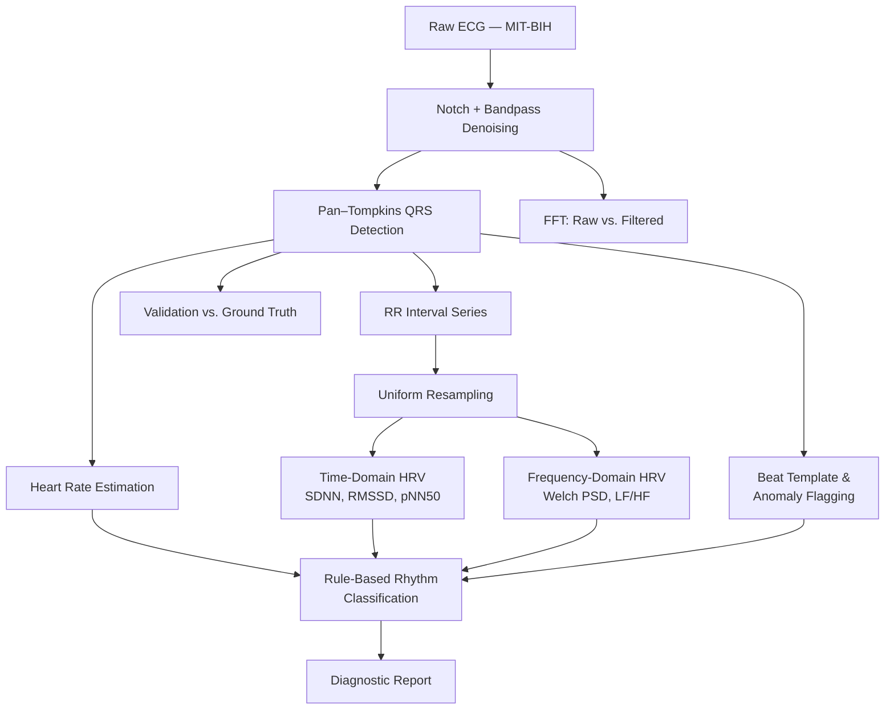

# ecg-analyzer

# 🫀 ECG Analyzer — The Anatomy of a Heartbeat

**A real-time cardiac diagnostics pipeline**, built entirely on classical signal processing — no black-box machine learning. Raw ECG voltage goes in; a cleaned waveform, detected heartbeats, HRV analysis, and a rule-based rhythm diagnosis come out.

**Team Signum** — Sumaiya Sultana Labiba (2305044) · Safa Tasnim (2305056)
CSE 220: Signals and Systems Sessional, BUET

🔗 **[Live Demo](https://electrocradiogram-analyzer.onrender.com)** · 📦 **[Repository](https://github.com/SumaiyaSultanaLabiba/ecg-analyzer)**

> ⚠️ **Disclaimer**: This is an educational, rule-based pattern-flagging prototype — **not a clinical diagnostic tool**. It has not undergone medical validation and should not be used to make health decisions.

---

## What it does

Feed it a real ECG recording from the [PhysioNet MIT-BIH Arrhythmia Database](https://physionet.org/content/mitdb/), and it:

1. **Cleans** the signal — removes 50/60 Hz powerline hum and baseline wander
2. **Detects every heartbeat** using the classical Pan–Tompkins algorithm
3. **Validates** its own accuracy against PhysioNet's expert-annotated ground truth (precision/recall)
4. **Analyzes heart rate variability** — both time-domain (SDNN, RMSSD, pNN50) and frequency-domain (a from-scratch DFT/Welch power spectral density estimate, LF/HF ratio)
5. **Flags abnormally-shaped beats** via cosine-similarity template matching
6. **Produces a rule-based rhythm classification** — tachycardia, bradycardia, irregular rhythm, and abnormal beat flags — with a generated diagnostic report

All of it visualized live in a multi-panel React dashboard.

---

## Project evolution

This project shipped in two versions.

| | Scope |
|---|---|
| **v1 — Detection & Validation** | Preprocessing, Pan–Tompkins QRS detection, heart rate, FFT spectrum view, and validation against ground-truth annotations |
| **v2 — Cardiac Diagnostics module** | Time- and frequency-domain HRV analysis, beat morphology/anomaly detection, and rule-based rhythm classification |

The original `/analyze` and `/validate` endpoints remain intact and independently testable; `/diagnose` sits alongside them as an additive module.

---

## The pipeline



For the full mathematical walkthrough of every stage — including the exact filter transfer functions, the Pan–Tompkins derivation, the DFT/Welch equations, and the cosine-similarity morphology test — see [`ECG_analyzer.pdf`](ECG_analyzer.pdf).

---

## Signal processing concepts applied

- **Convolution & LTI Systems** — every filtering stage (notch, bandpass, Pan–Tompkins derivative and moving-window integration) is implemented as convolution with a designed impulse response
- **Filter Design (FIR/IIR)** — Butterworth bandpass and biquad notch filters, with zero-phase (`filtfilt`) application to avoid timing distortion
- **Fourier Transform (DFT)** — implemented from first principles (not via FFT) to compute the Welch power spectral density underlying LF/HF analysis
- **Sampling & Discrete-Time Signals** — R-R interval resampling onto a uniform time grid before any frequency-domain analysis
- **Thresholding & Decision Logic** — adaptive thresholding for QRS localization; cosine-similarity thresholding for beat morphology
- **Power Spectral Density** — Welch's method (segmented, windowed, averaged periodograms) for LF/HF band-power estimation

---

## Tech stack

| Layer | Technology |
|---|---|
| Backend | Python, FastAPI, NumPy, SciPy |
| Data | [PhysioNet MIT-BIH Arrhythmia Database](https://physionet.org/content/mitdb/) via `wfdb` |
| Frontend | React, Vite, Recharts |
| Deployment | Render |

---

## API reference

| Endpoint | Description |
|---|---|
| `GET /api/records` | List available ECG records |
| `GET /api/analyze/{record_name}` | Full preprocessing + QRS detection + FFT spectrum + heart rate |
| `GET /api/validate/{record_name}` | Precision/recall of detected beats vs. PhysioNet ground truth |
| `GET /api/diagnose/{record_name}` | HRV metrics, PSD spectrum, flagged abnormal beats, rhythm classification |

---

## Dashboard panels

1. **Raw Signal** — unprocessed ECG waveform
2. **Filtered Signal** — cleaned waveform, with detected (and flagged-abnormal) beats marked
3. **Heartbeat Detection** — live heart rate readout
4. **Frequency Spectrum** — raw vs. filtered FFT magnitude
5. **Validation Dashboard** — precision/recall against expert annotations
6. **Cardiac Diagnostics** — HRV metrics table, R-R tachogram, LF/HF power spectrum, and rhythm classification summary

---

## Getting started

### Backend
```bash
cd backend
python -m venv venv
source venv/bin/activate    # Windows: venv\Scripts\activate
pip install -r requirements.txt
uvicorn app.run:app --reload
```

### Frontend
```bash
cd frontend
npm install
npm run dev
```
Visit `http://127.0.0.1:5173`

---

## Acknowledgments

- Pan, J. & Tompkins, W.J. (1985), *A Real-Time QRS Detection Algorithm*
- [PhysioNet](https://physionet.org/) and the MIT-BIH Arrhythmia Database
- Task Force of the European Society of Cardiology / NASPE — HRV measurement standards
